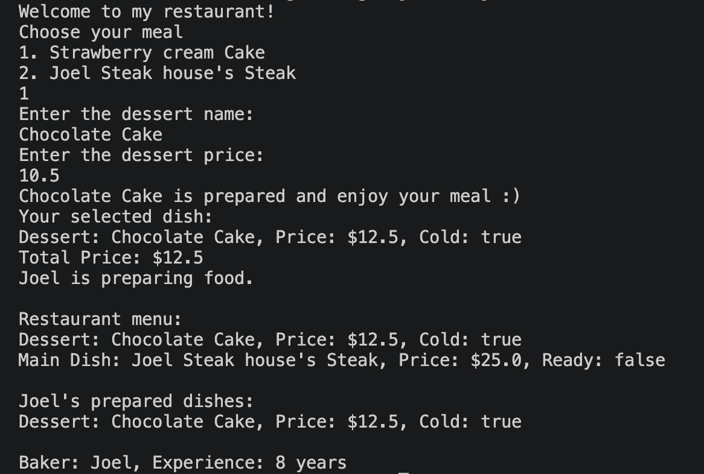
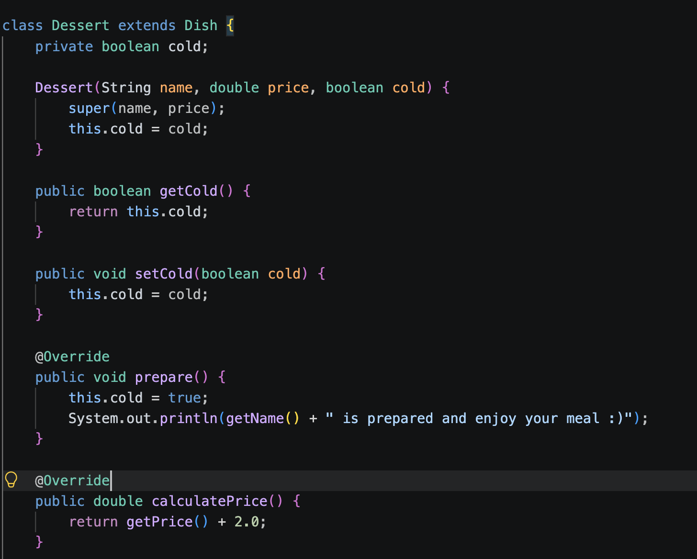

# Restaurant Ordering System

A Java-based restaurant ordering application developed during
my first semester of Information Technology at UTS College.

## Overview

The Restaurant Ordering System is a console-based Java application
that simulates a simple restaurant ordering process.

Users can:

- Select a dessert or main dish
- Enter a new dish name
- Enter a new dish price
- Prepare the selected dish
- Calculate the final price
- View the updated restaurant menu
- View dishes prepared by the baker
- View updated baker information

The project was developed to apply object-oriented programming
concepts in Java through a practical restaurant scenario.

---

## Features

- Display available dishes using an `ArrayList`
- Allow users to choose between dessert and main-dish options
- Update dish names and prices using user input
- Prepare the selected dish
- Calculate different final prices depending on the dish type
- Store different dish types using the common `Dish` parent class
- Track dishes prepared by the baker
- Display the final restaurant menu
- Increase baker experience after completing an order
- Handle keyboard input using Java `Scanner`

---

## Technologies & Concepts

- Java
- Object-Oriented Programming
- Classes and Objects
- Constructors
- Encapsulation
- Inheritance
- Method Overriding
- Polymorphism
- ArrayList
- Loops
- Enhanced For Loop
- User Input
- Getters and Setters
- `toString()`
- `Scanner`

---

## Class Structure

### Project

Contains the `main()` method and controls the restaurant ordering process.

The `Project` class:

- Creates the `Baker`, `Dessert` and `MainDish` objects
- Creates the restaurant menu
- Displays available dishes
- Processes the user's selection
- Updates dish information
- Displays the final results

### Dish

The parent class for restaurant dishes.

It stores common information including:

- Name
- Price

Important methods include:

- `getName()`
- `getPrice()`
- `setName()`
- `setPrice()`
- `prepare()`
- `calculatePrice()`
- `toString()`

### Dessert

Extends the `Dish` class.

It adds dessert-specific behaviour including:

- Cold status
- Special dessert preparation
- Additional dessert pricing

The class overrides:

- `prepare()`
- `calculatePrice()`
- `toString()`

### MainDish

Extends the `Dish` class.

It adds main-dish-specific behaviour including:

- Ready status
- Cooking behaviour
- Additional main-dish pricing

The class overrides:

- `prepare()`
- `calculatePrice()`
- `toString()`

### Baker

Stores information about the baker.

It contains:

- Baker name
- Years of experience
- An `ArrayList<Dish>` of prepared dishes

Important methods include:

- `work()`
- `increaseExperience()`
- `addPreparedDish()`
- `showPreparedDishes()`
- `toString()`

### In

Uses Java `Scanner` to handle keyboard input.

It provides methods for reading:

- Strings
- Characters
- Integers
- Double values

---

## OOP Example

The following code demonstrates inheritance,
encapsulation and method overriding.

```java
class Dessert extends Dish {

    private boolean cold;

    Dessert(String name, double price, boolean cold) {
        super(name, price);
        this.cold = cold;
    }

    @Override
    public void prepare() {
        this.cold = true;

        System.out.println(
            getName() + " is prepared and enjoy your meal :)"
        );
    }

    @Override
    public double calculatePrice() {
        return getPrice() + 2.0;
    }
}
```

The `Dessert` class inherits common properties from `Dish`
while providing its own specialised implementation of
`prepare()` and `calculatePrice()`.

---

## Polymorphism & ArrayList

The program stores both `Dessert` and `MainDish` objects
inside an `ArrayList` using the common `Dish` type.

```java
ArrayList<Dish> menu = new ArrayList<Dish>();

menu.add(cake);
menu.add(steak);

for (Dish dish : menu) {
    System.out.println(dish);
}
```

Because both `Dessert` and `MainDish` extend `Dish`,
different child objects can be managed through the same parent type.

Their overridden methods provide different behaviour
depending on the actual object stored in the list.

---

## Program Output

The following screenshot shows the Restaurant Ordering System
running and processing a user order.

The user selects a dessert, enters a new name and price,
and the program calculates the final price before displaying
the updated menu and baker information.



---

## OOP Code Screenshot

The following screenshot shows the `Dessert` class
implemented in Java.

It demonstrates:

- Inheritance
- Encapsulation
- Parent constructor calls using `super()`
- Method overriding



---

## Example Program Flow

```text
Welcome to my restaurant!
Choose your meal

1. Strawberry cream Cake
2. Joel Steak house's Steak

Enter the dessert name:
Chocolate Cake

Enter the dessert price:
10.5

Chocolate Cake is prepared and enjoy your meal :)

Your selected dish:
Dessert: Chocolate Cake, Price: $12.5, Cold: true

Total Price: $12.5
```

---

## What I Learned

This project improved my understanding of how
object-oriented programming can be used to model
real-world systems.

I gained practical experience with:

- Classes and objects
- Constructors
- Encapsulation
- Inheritance
- Method overriding
- Polymorphism
- ArrayList
- Loops
- Getters and setters
- User input
- Object interaction
- Debugging Java programs

I also learned how parent and child classes can work together
to create reusable and organised program structures.

---

## Source Code

The complete Java application is available in:

[`Project.java`](Project.java)

---

## Author

Joel Lee

UTS College  
Diploma of Information Technology
